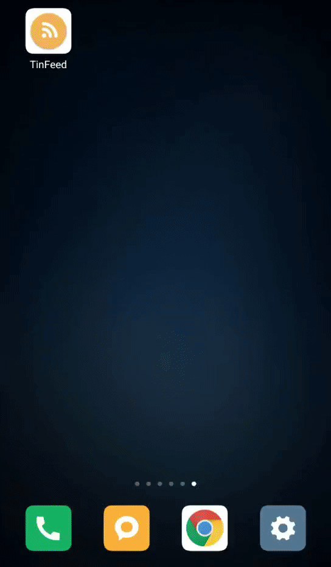

# TinFeed: a Tinder-like Android News App
* Designed a Tinder Flavor News Android app based on MVP architectural pattern
* Implemented ViewPager with BottomBar that holds News/Save/Profile tabs' state in MainActivity concurrently
* Utilized PlaceHolderView to support swipe gestures for liking/disliking the news
* Integrated Retrofit, Rxjava and Picasso to present the latest news data captured from newsapi.org
* Utilized Room to store favored news and EventBus to communicate between fragments
* Implemented RecyclerView and ViewModel to display news content dynamically

### Demo

